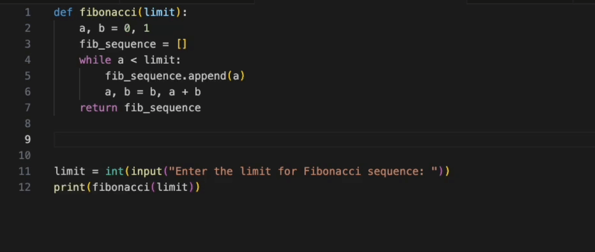

<p align="center">
  
</p>

<h1 align="center">
  Comment Divider Extension
</h1>

This extension provides commands for separating line content with comments for readability. This is an extension of the [original Comment Divider extension](https://github.com/stackbreak/comment-divider), where the filler symbols are fully customisable.

**[Supports all common languages](#language-support).**

## Install

https://marketplace.visualstudio.com/items?itemName=sujenp.comment-divider-ext

## Demo



## Customizations

Unlike the existing fillers in the [original Comment Divider extension](https://github.com/stackbreak/comment-divider), the fillers are not limited to one character. Moreover, there are extensive customisation to all the filler symbols.

### Main header

```json
  // "Set symbol for main header line filling.
  "comment-divider.mainHeaderFiller": "-",

  // "Set symbol for main header top line.
  "comment-divider.mainHeaderFillerTop": "-",

  // "Set symbol for main header bottom line.
  "comment-divider.mainHeaderFillerBottom": "-",
```

### Subheader

```json
  // "Set symbol for subheader line filling.
  "comment-divider.subheaderFiller": "-",
```

## Commands

### Make main header

- Default Shortcut:
  **`Shift`** + **`Alt`** + **`X`**

- Default Style:

  ```
  /* -------------------------------------------------------------------------- */
  /*                                Example text                                */
  /* -------------------------------------------------------------------------- */
  ```

### Make subheader

- Default Shortcut:

  **`Alt`** + **`X`**

- Default Style:

  ```
  /* ------------------------------ Example text ------------------------------ */
  ```

### Insert solid line

- Default Shortcut:

  **`Alt`** + **`Y`**

* Default Style:

  ```
  /* -------------------------------------------------------------------------- */
  ```

## Language Support

Extension uses relevant comment characters for all common languages.

For example, in python files subheader looks like

```python
# ------------------------------ python example ------------------------------ #
```

or in html files

```html
<!-- ---------------------------- html example ----------------------------- -->
```

**Also, you can easily [add support](#languages-configuration) for any missing language or override the default preset.**

## Default Configuration

### Common

```json
  // Set line length for all dividers.
  "comment-divider.length": 80,
```

```json
  // Set whether the divider will be shrink consider indent size, or will be always fixed length.
  "comment-divider.shouldLengthIncludeIndent": false,
```

- **if `shouldLengthIncludeIndent: false`**

  ```js
  /* --------------------------------- indent0 -------------------------------- */

  /* --------------------------------- indent1 -------------------------------- */

  /* --------------------------------- indent2 -------------------------------- */
  ```

- **if `shouldLengthIncludeIndent: true`**

  ```js
  /* --------------------------------- indent0 -------------------------------- */

  /* ------------------------------- indent1 ------------------------------ */

  /* ----------------------------- indent2 ---------------------------- */
  ```

### Main Header

```json
  // "Set symbol for main header line filling.
  "comment-divider.mainHeaderFiller": "-",

  // "Set symbol for main header top line.
  "comment-divider.mainHeaderFillerTop": "-",

  // "Set symbol for main header bottom line.
  "comment-divider.mainHeaderFillerBottom": "-",

  // Set main header vertical style.
  "comment-divider.mainHeaderHeight": "block",

  // Set main header text align.
  "comment-divider.mainHeaderAlign": "center",

  // Set main header text transform style.
  "comment-divider.mainHeaderTransform": "none",
```

### Subheader

```json
  // "Set symbol for subheader line filling.
  "comment-divider.subheaderFiller": "-",

  // Set subheader vertical style.
  "comment-divider.subheaderHeight": "line",

  // Set subheader text align.
  "comment-divider.subheaderAlign": "center",

  // Set subheader text transform style.
  "comment-divider.subheaderTransform": "none",
```

### Solid Line

```json
  // Set symbol for solid line filling.
  "comment-divider.lineFiller": "-",
```

## Languages Configuration

If some language is not supported out of the box, or you want to change default comment characters for an already supported language, it is possible to do it in the settings.

```json
"comment-divider.languagesMap": {
      "toml": ["#", "#"],
      "scss": ["//"]
}
```

The item name is the language mode name and is associated with an array of 1 or 2 elements. The first element is the start of the line. The second, if defined, is the end.

The example above defines the right characters for `toml` and overrides `scss` defaults. As a result, the subheaders for these languages look like this:

```toml
# ------------------------------ toml subheader ------------------------------ #
```

```scss
// ----------------------------- scss subheader --------------------------------
```

## Issues

Request features and report bugs using [GitHub](https://github.com/sujenphea/comment-divider/issues).
